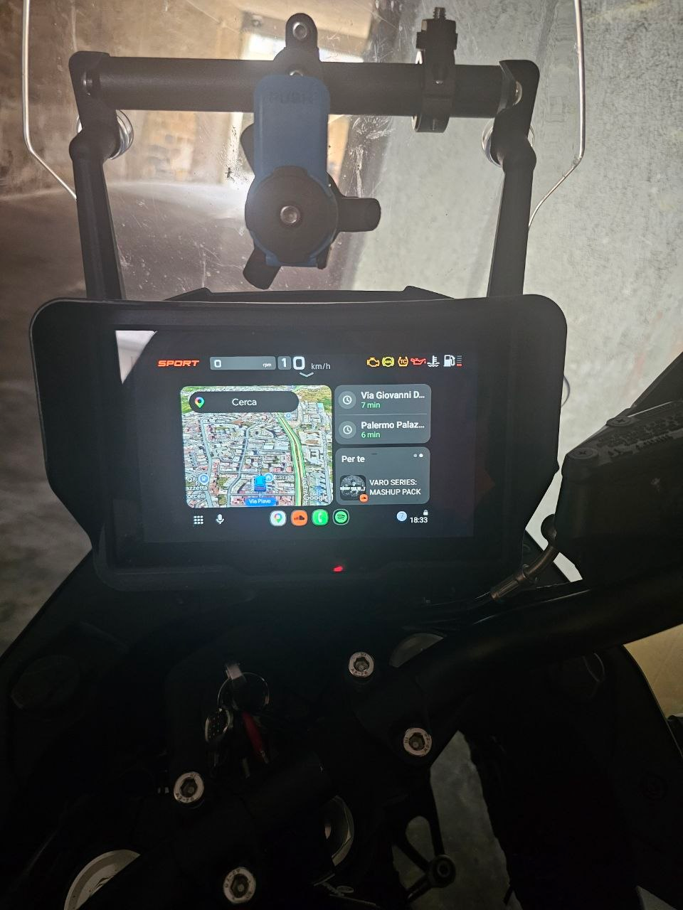
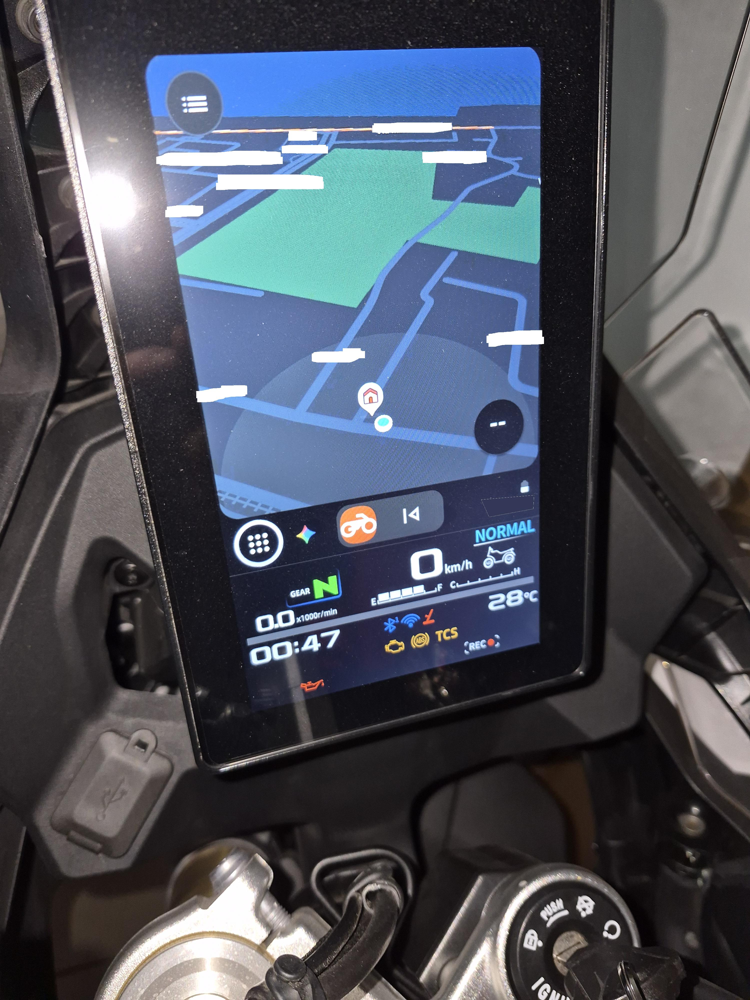
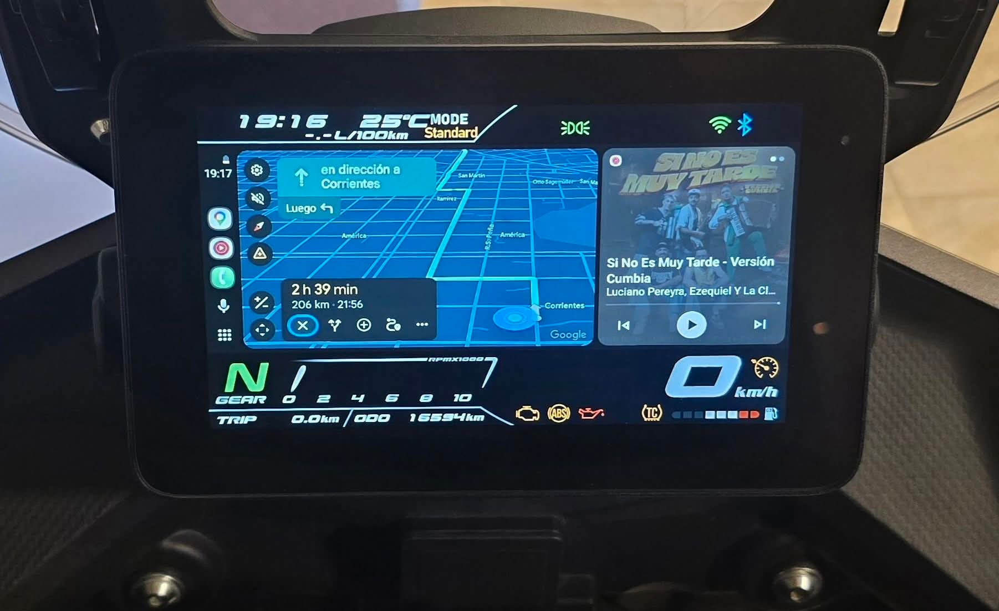

# Dash showcase

Community photos of **OpenCfMoto / Android Auto** on real EasyConnect dashes.
Full model list: [SUPPORTED-BIKES.md](SUPPORTED-BIKES.md). Send more in Discord
[`#confirmed-working`](https://discord.gg/xRt5yZy2U) (model + year + photo).

Photos are curated from Discord (caption / thread context). Credits under each shot.

---

## CFMoto

### 1000MT-X

Portrait CFDL26 dash with Android Auto navigation.

*Source: Discord `#confirmed-working` / 1000MTX EU — @jiri_71427*

### 800MT-X

Portrait layout — maps + media widgets over bike telemetry.

*Source: Discord `#confirmed-working` — @joyfulyak*

### 800MT Explore

Landscape touch dash (CFDL26 class).

*Source: Discord `#confirmed-working` — @gaetan_95*

### 700MT Adventure

Android Auto split view on the adventure dash.

*Source: Discord `#confirmed-working` / 700MT ADV — @deathredshot*

### 450MT

Android Auto on the 450MT cluster.

*Source: Discord `#confirmed-working` — @t4n3lr*

### 675NK

Android Auto Maps on the 675NK (dual-screen setups common).

*Source: Discord `#confirmed-working` / 675NK — @misterio333*

### 800NK

Non-touch / focus-mode style dash with Android Auto media.

*Source: Discord `#confirmed-working` — @maxcalavera*

### 150SC

Scooter EasyConnect path — Android Auto navigation.

*Source: Discord `#confirmed-working` — @farhandgreat1730*

---

## Other brands

### Voge DS800 Rally

Community-confirmed Carbit / EasyConnect QR path.

*Source: Discord `#confirmed-working` — @800rall_03186 (“ok on voge 800 rally”)*

### Moto Morini X-Cape 649

Night ride — Android Auto on the X-Cape dash.

*Source: Discord `#confirmed-working` — @levi2m*

### Moto Morini X-Cape 700

Android Auto Maps (also reported with X-Cape 650 / 700 @ 1280×720).

*Source: Discord `#welcome` — @tutoscaldera*

### Moto Morini Seiemmezzo

Community-confirmed — MotoFun / EasyConnect QR.

*Source: Discord `#confirmed-working` — @fedecom20044461*

### Morbidelli T1002V / T1002VX

Android Auto split (maps + media) on the Carbit dash.

*Source: Discord `#confirmed-working` — @tutoscaldera (friend’s T1002V)*

---

## Still looking for a clean still

| Model | Notes |
| --- | --- |
| **GOES Terrox 1000** / **Gladiator G3 1000** | Confirmed — we have Discord video; need a clear still for this page |
| **CFORCE 850 / 1000** | Confirmed — want a dash photo |
| **800NK Advanced** · **450SR** · **450CL‑C** | Confirmed in docs — want showcase photos |
| **QJ Motor 550/600SX** | In progress |

---

## Adding a photo

1. Post in Discord `#confirmed-working` with **model + year** (and a clear dash shot).
2. We’ll copy a hero into `docs/media/showcase/<model-slug>/` and add a section here.
